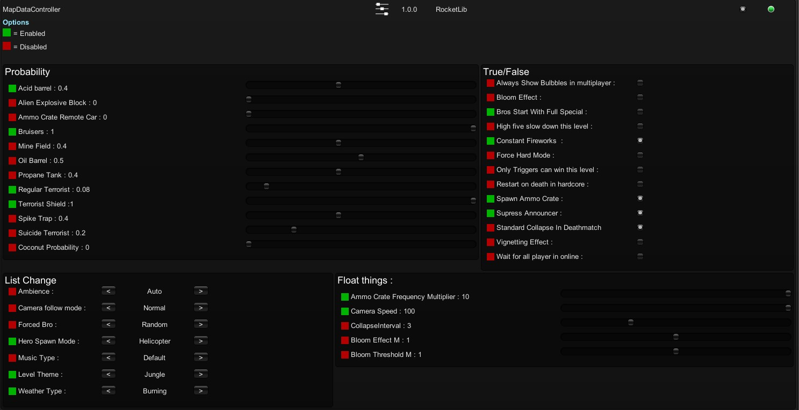
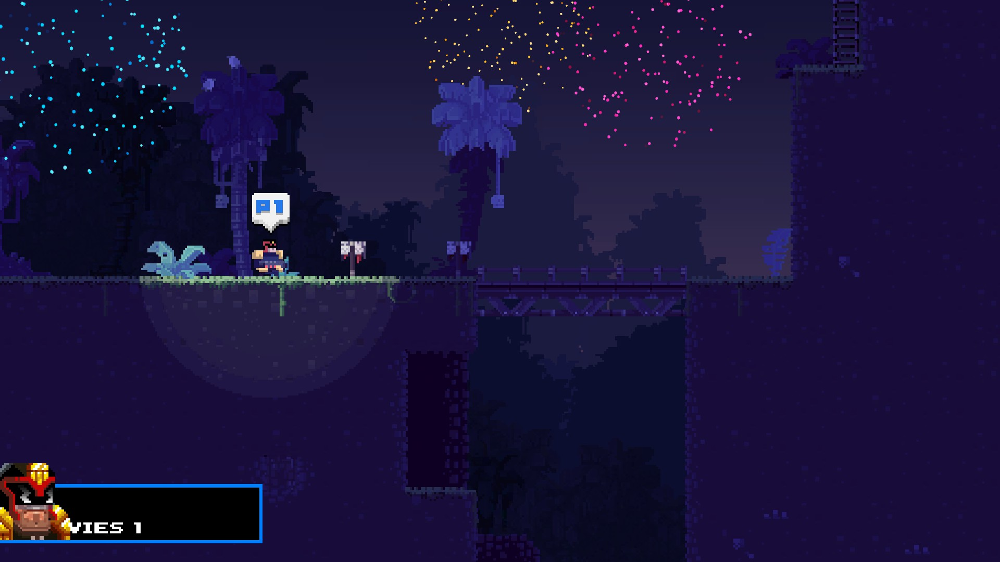

# Map Data Controller

[NexusMods Page](https://www.nexusmods.com/broforce/mods/18)  
You can change some data which is load before a level.  
You need RocketLib.

## Installation

* The all and [latest](./Release/MapDataControllerMod.zip) release are in the [Release](./Release/) folder.
* Dependency: [RocketLib](https://www.nexusmods.com/broforce/mods/9)

## Know Issue

* Loading screen is longer.
* The chance of breaking the map is high.
* Sometimes the check in the GUI disappear

## Incompatible

* None

## Showcase

