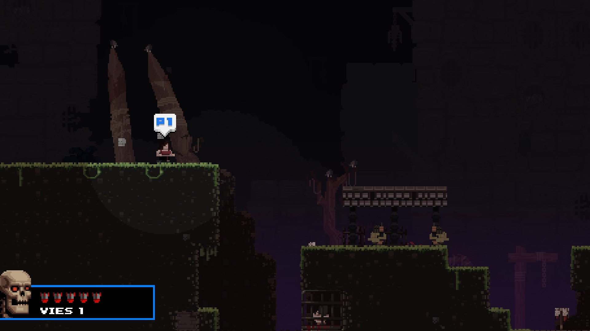
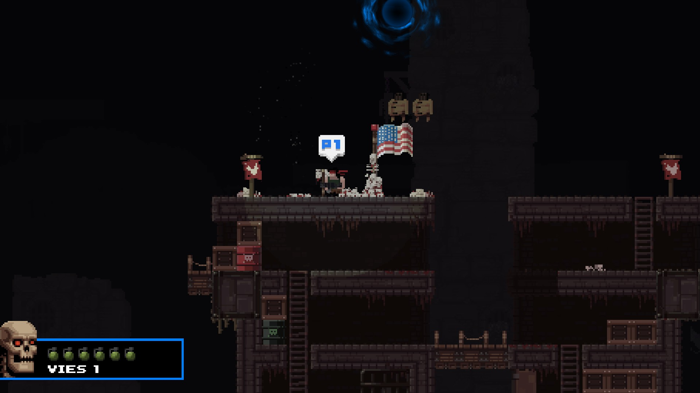

# Spooktober

[NexusMods Page](https://www.nexusmods.com/broforce/mods/17)  
Spooky

## Installation

* The all and [latest](./Release/SpooktoberMod.zip) release are in the [Release](./Release/) folder.
* Dependency: [RocketLib](https://www.nexusmods.com/broforce/mods/9)

## Know Issue

* When re-spawning on a super checkpoint, the theme is the original one.

## Incompatible

* None

## Showcase

